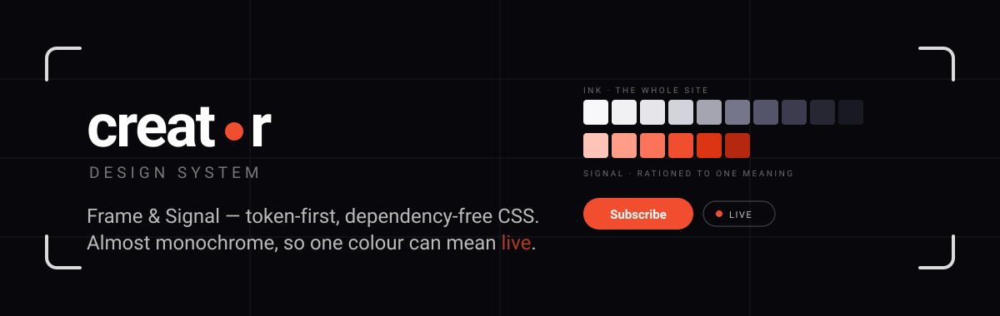
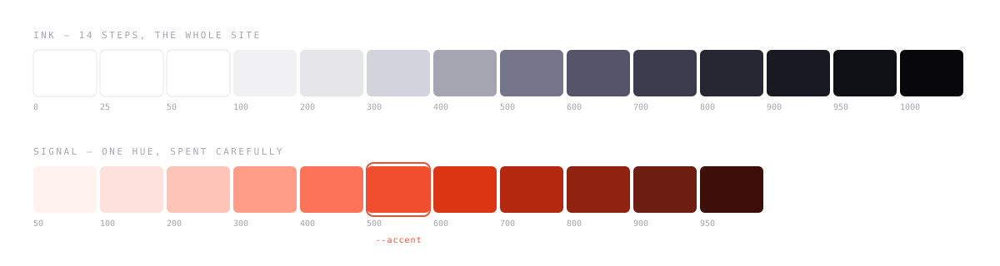
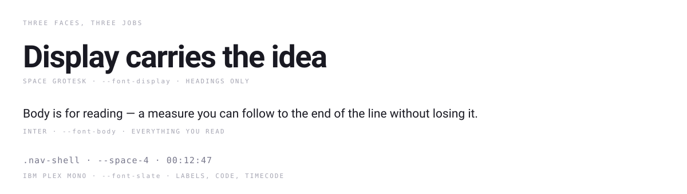
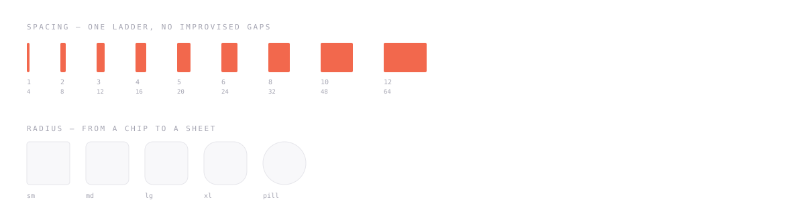
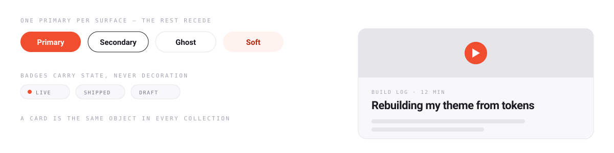
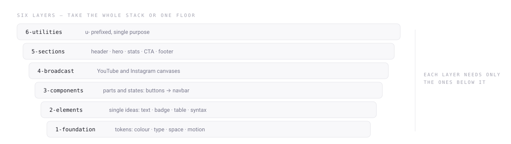
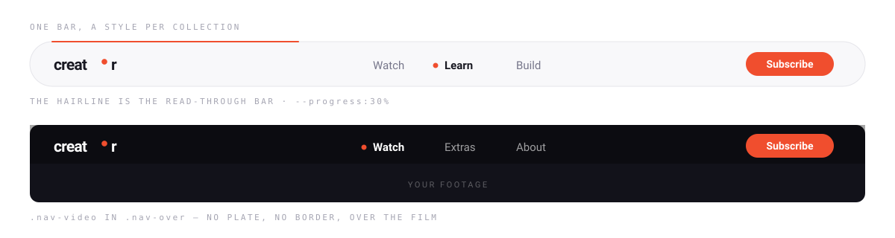

<div align="center">

# Creator Design System

**Frame & Signal** — a token-first, dependency-free CSS design system
for creators building their own site.

Almost monochrome, so that one colour can mean something.

[](https://github.com/imswarnil/Creator-Design-System/actions/workflows/ci.yml)
[](https://github.com/imswarnil/Creator-Design-System/actions/workflows/pages.yml)
[](LICENSE)
[](https://github.com/imswarnil/Creator-Design-System/stargazers)



[Documentation](https://creator.imswarnil.com) ·
[Components](https://creator.imswarnil.com/components.html) ·
[Showcase](https://creator.imswarnil.com/showcase.html) ·
[Templates](https://creator.imswarnil.com/templates.html) ·
[Sponsor](https://github.com/sponsors/imswarnil)

If this saved you a rebuild, a ⭐ on the repo is the easiest way to say so.

</div>

---

## Why

Creators publish in more shapes than anyone: posts, videos, courses, series,
products, trips. Each shape pulls the design somewhere else — the video page
wants Netflix, the course page wants Udemy, the blog wants Medium. Copy all
three and the site becomes a mall.

This system settles the argument once, in tokens, and then reuses the answer
everywhere — including the YouTube thumbnails and the Instagram posts.

- **Plain CSS.** No framework, no build step required, no runtime.
- **Two-tier tokens.** Change three variables, rebrand the whole site.
- **Light & dark**, from the same variables.
- **State lives in ARIA**, so styling and the accessibility tree can't disagree.
- **The platform first** — `<details>`, `<dialog>`, the Popover API, native inputs.

## What you get

Two ramps. Ink does the whole site; signal is rationed so hard that when it
appears, it means something — live, now, here.



Three faces, three jobs, and no fourth one waiting to be argued about.



One spacing ladder and one radius set, so no gap is ever invented at the
last minute.



Components inherit all of it. A card is the same object whether it holds a
post, an episode or a day of a trip.



## Install

```html
<!-- works today, straight from the repo -->
<link rel="stylesheet"
      href="https://cdn.jsdelivr.net/gh/imswarnil/Creator-Design-System@main/dist/creator.min.css">
```

```bash
npm install creator-design-system   # with the first tagged release
```

```css
@import "creator-design-system";
```

Or take one layer at a time:

```css
@import "creator-design-system/foundation";   /* tokens only            */
@import "creator-design-system/elements";
@import "creator-design-system/components";
@import "creator-design-system/sections";
@import "creator-design-system/utilities";
@import "creator-design-system/broadcast";    /* YouTube / social art   */
```

### Download

Grab `dist/creator.css` from a [release](https://github.com/imswarnil/Creator-Design-System/releases)
and link it. That is the whole installation.

## Make it yours

Never edit the source. Override tokens *after* the import — every component
reads them live, in both themes. This is the entire customization API:

```css
:root {
  --accent: #6d4aff;                          /* your signal colour */
  --font-display: 'Clash Display', sans-serif;
  --radius-card: 1.25rem;
}
```

Dark mode rides `data-theme="light|dark"` on `<html>`.

## Works with your stack

| Stack | How |
| --- | --- |
| Plain CSS | link `dist/creator.css`, done |
| SCSS | `@use` the same files; tokens are CSS custom properties, so runtime theming survives |
| Tailwind | keep the component classes and map the tokens into `theme.extend` — the `u-` prefix means zero collisions |
| Ghost / Astro / 11ty | it is just a stylesheet |

## Layers

| Layer | Holds |
| --- | --- |
| `1-foundation` | tokens: colour, type, space, elevation, motion, layout, patterns, logo, icons, shape, cutouts, frames |
| `2-elements` | single ideas: text, badge, table, indicator, syntax |
| `3-components` | things with parts and states: buttons → overlays → navbar → composites |
| `4-broadcast` | export canvases for YouTube and Instagram |
| `5-sections` | full-width bands: page header, hero, stats, CTA, footer |
| `6-utilities` | `u-`-prefixed single-purpose classes |
| `highlight.js` | the system's own syntax highlighter — optional, no dependency |
| `nav.js` | scroll state, hover-intent dropdowns, panels — optional, no dependency |



## Navbar



One component, a style per collection. The bar above a web series should not
look like the bar above a shop, so each collection sets its own defaults — and
only defaults:

| Class | What it assumes |
| --- | --- |
| `.nav-video` | the series — no island at all: the bar sits *over* the footage and becomes furniture once you scroll past it |
| `.nav-blog` | the writing — flat, hairline underneath, no plate |
| `.nav-course-bar` | the syllabus — a soft plate with room for the read-through line |
| `.nav-shop` | the shop — a squarer plate, actions spaced for a cart |
| `.nav-trip` | the journal — the accent warms the bar itself |
| `.nav-docs-bar` | the reference — 2.75rem, flat, dense |

Every one of them is written in the same six variables, and yields to any of
them: `--bar-bg`, `--bar-fg`, `--bar-line`, `--bar-radius`, `--bar-h`,
`--bar-blur`. The class is a shorthand, not a cage.

```html
<header class="nav-shell nav-shell-full nav-over">
  <nav class="nav-bar nav-video">… mark · links · actions …</nav>
</header>
<div class="nav-over__media">
  <video src="…" autoplay muted loop playsinline></video>
</div>
<script src="creator-design-system/src/nav.js" defer></script>
```

`nav.js` is optional and additive: it sets `data-scrolled`, `data-dir` and
`data-open`, all of which the stylesheet already understands, so the CSS stays
the single description of how the bar looks. Without it you get a plain sticky
island and click-only dropdowns — nothing breaks.

| Shell | Behaviour |
| --- | --- |
| `.nav-shell` | sticky island (default) |
| `.nav-shell-fixed` | pinned to the top, always |
| `.nav-shell-auto` | hides going down, returns going up |
| `.nav-shell-morph` | full-bleed at rest, contracts into the island on scroll |
| `.nav-over` | over media: transparent on the footage, ink once you pass it |

The island's hairline doubles as the read-through bar (`.nav-progress` +
`--progress`), the burger runs record → play rather than bars → X
(`.nav-burger-rec`), and the docs page ends in a
[builder](https://creator.imswarnil.com/navbar.html) that writes the markup for
whatever combination you land on.

## Collections

A collection is the system proving itself on real content — every route
built from the same tokens and the same `collection/shell.py`, with its own
page-transition flavour on arrival:

| Collection | Route | What it demonstrates |
| --- | --- | --- |
| Travel | `/collection/travel/` | region → country → city → trip, an itinerary and a video hero |
| Courses | `/collection/course/` | track → topic → course → lesson, a stage, playlist and transcript |
| Blog | `/collection/blog/` | tags, reading time, a plain post |
| Web series | `/collection/webseries/` | genre → show → season → episode, a cast list |
| Newsletter | `/collection/newsletter/` | calendar-styled issue cards, live dates |
| Projects | `/collection/projects/` | GitHub-style cards, a build-log timeline, hero-shrink-on-click |
| Videos | `/collection/videos/` | a channel hero, an upload list, chapters + "products I use" |
| Guides | `/collection/guides/` | book-cover cards with a colour-blend cover, a stepper between steps |
| Prompts | `/collection/prompts/` | a chat-bubble card, one prompt per page |
| Snippets | `/collection/snippets/` | a language tag + fading code preview, one snippet per page |
| Products I use | `/collection/products/` | grouped hardware/software/video-setup rows |
| Pages | `/collection/_pages/` | home, about, contact, archive, now, résumé, terms, privacy, welcome |
| Docs (template) | `/collection/docs/` | a reusable three-column docs shape for your own project |

None of it is fictional infrastructure — open any route straight from disk
(the stylesheets are relative paths) or serve `collection/` with any static
file server. Each folder's `build.py` is the generator; edit the data at the
top and re-run it.

## Syntax highlighting



The one piece of JavaScript in the box. Drop it in and any code block that
names a language is coloured with the same five token roles the CSS already
ships, in both themes:

```html
<figure class="codebox" data-play>
  <figcaption class="codebox__head"><span class="codebox__lang">css</span></figcaption>
  <pre class="codebox__pre"><code>.card { color: var(--fg-default); }</code></pre>
</figure>
<script src="creator-design-system/src/highlight.js" defer></script>
```

It reads the language from `data-lang` on the `<code>`, a `language-*` class,
or the `.codebox__lang` caption. Five languages: `html`, `css`, `js`, `json`,
`bash`. Anything else is left plain rather than mis-coloured. Code that
already carries hand-written markup is never rewritten.

`data-play` settles the block in — one short fade and rise — the first time it
scrolls into view. It is skipped entirely under `prefers-reduced-motion`, and
the finished state is the resting state, so the code is never hidden behind
the animation.

Call it yourself when you inject markup later:

```js
CreatorHighlight.scan(container);            // everything under a root
CreatorHighlight.highlight(code, 'css');     // -> token HTML string
```

## For AI agents

Point any assistant at these and it will use real class names instead of
guessing — the single worst failure mode for a CSS library, because guessed
markup looks right and renders as unstyled HTML.

| File | For |
| --- | --- |
| [`creator.imswarnil.com/llms.txt`](https://creator.imswarnil.com/llms.txt) | the index: what the system is, how to install and customise it |
| [`creator.imswarnil.com/llms-full.txt`](https://creator.imswarnil.com/llms-full.txt) | every token and every class the system defines, plus the rules |
| [`AGENTS.md`](AGENTS.md) | working *on* this repo — commands, generated files, house rules |

Both `llms` files are generated from the stylesheets on every build, so they
cannot drift from the code.

## Develop

```bash
npm install
npm run dev     # builds the docs and serves them at http://localhost:8080
npm run build   # dist/creator.css + dist/creator.min.css + docs
npm run lint
```

The docs are generated: edit `docs/_build/content_*.py`, then `npm run docs`.
Never edit the generated `docs/*.html` by hand.

The specimens above are generated too — `python3 media/build.py` redraws them
from the token values in `src/1-foundation`, so when a colour changes the
picture of it changes with it. Each one carries both themes and switches on
`prefers-color-scheme`, which is the same contract the CSS makes.

## Contributing

Issues and pull requests are welcome — see [CONTRIBUTING.md](CONTRIBUTING.md).
Adding your site to the [Showcase](showcase/README.md) is one small file.

## Sponsor

This is free and MIT-licensed. If it saved you a weekend,
[sponsoring](https://github.com/sponsors/imswarnil) keeps it maintained.

## Licence

[MIT](LICENSE) © Swarnil Singhai
