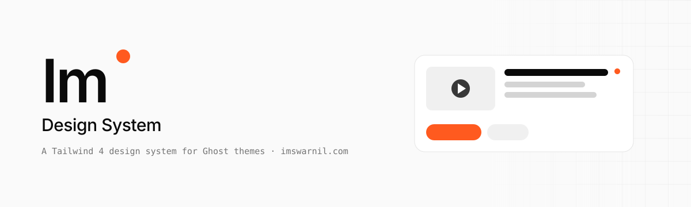
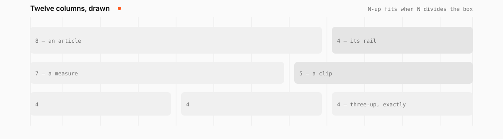

<p align="center"></p>

# Im Design System

The design system behind **[imswarnil.com](https://imswarnil.com)** and its Ghost theme — tokens, layout, forty-odd components, page sections and fourteen content collections, all namespaced `im-*` / `--im-*`, built on Tailwind 4 cascade layers. One look; a variant is a modifier class, never a second skin.

**Docs:** [design.imswarnil.com](https://design.imswarnil.com) — every example renders the real partial, so a page breaks if a component does.

<p align="center"></p>

Every layout is **measured** in one twelve-column grid, and the grid is drawn — one hairline down the middle of each gutter, behind everything. A rail is three or four columns, a hero's measure seven, the side nav two. Each container publishes how many columns it holds (`--im-grid-of`), so a feed inside an eight-column article divides eight and not twelve. An N-up grid lands on the lines only when **N divides the box's count**: twelve takes 2, 3, 4 and 6, which is why twelve is the number.

```bash
npm install
npm run dev      # http://localhost:4700
npm run build    # writes the docs to dist/ and checks every Ghost helper is modelled
npm run check    # dead CSS, broken links, provenance — CI runs this before deploying
npm run mcp      # an MCP server, so an AI assistant can build with the system
```

## What is in it

| | |
| --- | --- |
| `src/foundation` | primitive and semantic tokens, motion, type, the two shared states (`--im-current-*`, `--im-hover-bg`) |
| `src/layout` | shell, top bar, side nav, the single and rails page layouts, the player, the footer |
| `src/layout/guides.css` | the twelve columns, drawn on the page |
| `src/layout/fit.css` | the column context every container publishes, and what fills a cell |
| `src/components` | cards for every collection, editor, chat, stream, tiers, auth, sitemap, ads, comments, widgets… |
| `partials/` | the Handlebars partials a Ghost theme copies in |
| `sections/` | self-contained page sections |
| `site/` | the documentation site — Handlebars pages with a Ghost shim |
| `mcp/` | the MCP server (`list_components`, `get_component`, `list_tokens`, `search`, `get_page`, `rules`) |
| `scripts/` | `unused-css.mjs` — every `im-*` class nothing puts on an element (it returns nothing today) |
| `.github/` | the banner and the grid drawing above, both plain SVG that follow the reader's colour scheme |

Fourteen collections ship with a listing, a card and a single page each: post,
project, series, course, video, shop, newsletter, uses, snippets, prompts,
travel, experience, tags and the timeline, plus an archive of all of them. The
pages a personal site needs — about, now, contact, membership, sign in, résumé,
guestbook, sitemap, home — are in `site/pages/pages/`.

## Using it in a theme

Vendor it — copy `dist/assets/im.css`, the `src/js/*.js` files, the fonts and the partials you use into the theme and commit them. Set `"config": { "card_assets": false }` in the theme's `package.json` and ship `im-content.js`, or Ghost's own card CSS (which is unlayered) beats every layer here.

Rules that matter: every field a template reads must not share a Ghost helper's name (`date`, `price`, `code`, `url`…); a component never sets its own margin; the dot means *new*, never *active*; anything that plays wears `im-thumb im-thumb-play`.

## With an AI assistant

Two ways in, and they are better together. The **skill** teaches an agent the rules and the
shapes; the **MCP server** lets it read the real components at call time.

```bash
npx skills add https://github.com/imswarnil/Swarnil-Design-System --skill im-design-system
```

```json
{ "mcpServers": { "im-design-system": { "command": "node", "args": ["mcp/server.mjs"] } } }
```

The server reads this repository at call time, so it can never describe a component that has changed.

## Reading a page's source

Every page of the docs carries an **Edit this page** link under its contents, straight to the
`.hbs` it is written in. The repository is public so the link works and the whole system can be
read; the licence below is unchanged.

## Provenance

Nothing here comes from a commercial theme, and everything from outside is openly licensed and listed in [PROVENANCE.md](PROVENANCE.md). Fonts are Geist, Geist Mono and Geist Pixel only. All rights reserved — see [LICENSE](LICENSE).
